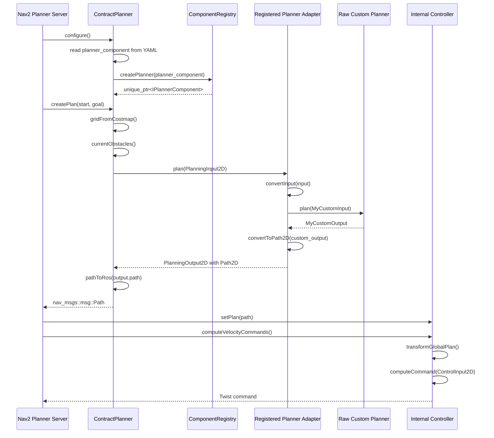

# cc01_autonomous_robots

## Current Structure

This workspace keeps ROS 2 and Nav2 integration internal. The only external
extension point is global planning.

- `autonomy-sim/autonomy_contracts`: ROS-free planner boundary types, registry,
  registration macros, and compile-time trait checks.
- `autonomy-sim/autonomy_ros2_wrapper`: Nav2 planner/controller adapters and the
  internal default control/perception implementations.
- `autonomy-sim/external_components`: local or fetched plain C++ planner repos.

Control and perception are not external link boxes anymore. They use common
defaults inside `autonomy_ros2_wrapper`:

- `pure_pursuit_controller`
- `noop_perception`

External planner code may use custom internal input/output types, but the class
registered with this wrapper must be an adapter with this boundary:

```cpp
autonomy_contracts::PlanningOutput2D plan(
  const autonomy_contracts::PlanningInput2D& input);
```

The returned `PlanningOutput2D` must contain a usable `Path2D`, because Nav2 and
the internal controller consume that path.

## Runtime Sequence



## Planner Adapter Workflow

Your raw planner can be custom:

```cpp
class MyRawPlanner
{
public:
  MyCustomOutput plan(const MyCustomInput& input);
};
```

The registered adapter normalizes that planner into the wrapper contract:

```cpp
#include "autonomy_contracts/autonomy_contracts.hpp"
#include "my_planner/my_raw_planner.hpp"

namespace my_planner
{

class MyPlannerAdapter
{
public:
  autonomy_contracts::PlanningOutput2D plan(
    const autonomy_contracts::PlanningInput2D& input)
  {
    MyCustomInput custom_input = convertInput(input);
    MyCustomOutput custom_output = raw_planner_.plan(custom_input);

    autonomy_contracts::PlanningOutput2D output;
    output.success = true;
    output.path = convertToPath2D(custom_output);
    return output;
  }

private:
  MyRawPlanner raw_planner_;
};

}  // namespace my_planner

REGISTER_PLANNER_COMPONENT("my_planner", my_planner::MyPlannerAdapter)
```

Register the adapter, not the raw planner.

## External Planner Repository Layout

External planner repositories should be plain C++ CMake projects. They should not
include ROS 2, Nav2, lifecycle nodes, topics, or ROS messages.

Recommended layout:

```text
my_planner/
  CMakeLists.txt
  include/my_planner/my_raw_planner.hpp
  src/my_planner_adapter.cpp
```

Minimal `CMakeLists.txt`:

```cmake
cmake_minimum_required(VERSION 3.15)
project(my_planner)

add_library(my_planner_lib SHARED
  src/my_planner_adapter.cpp
)

target_include_directories(my_planner_lib PUBLIC
  $<BUILD_INTERFACE:${CMAKE_CURRENT_SOURCE_DIR}/include>
  $<INSTALL_INTERFACE:include>
)

ament_target_dependencies(my_planner_lib
  autonomy_contracts
)
```

Put custom planner types and algorithm code in `include/my_planner/` or other
private files. Put the wrapper-facing adapter and `REGISTER_PLANNER_COMPONENT`
call in `src/my_planner_adapter.cpp`.

## Link The Planner

Edit `autonomy-sim/external_components/component_manifest.cmake`. It has one
external link section:

- `PLANNING COMPONENT LINK`

For a local planner repo:

```cmake
autonomy_fetch_component(
  NAME my_planner
  SOURCE_DIR "${CMAKE_CURRENT_LIST_DIR}/my_planner"
  TARGET my_planner_lib
)
```

For a GitHub planner repo:

```cmake
autonomy_fetch_component(
  NAME my_planner
  GIT_REPOSITORY https://github.com/your-org/my-planner.git
  GIT_TAG main
  TARGET my_planner_lib
)
```

The `TARGET` must be the library that contains the adapter registration.

## Select The Planner

Set the registered planner name in the Nav2 YAML:

```yaml
GridBased:
  plugin: "autonomy_ros2_wrapper/ContractPlanner"
  planner_component: "my_planner"
```

The included reference planner is:

- `bfs_grid_planner`

## Contract Verification

External planners are verified when this repository builds. The registration macro
calls C++17 `static_assert` checks from `autonomy_contracts`.

The build fails if the registered adapter:

- does not use `plan`
- does not accept `PlanningInput2D` by `const&`
- does not return `PlanningOutput2D`
- is not default constructible

Runtime selection is also checked. If YAML requests a planner name that was not
registered by any linked library, `autonomy_ros2_wrapper` logs the available
registered names and fails to create that planner.

## Simulation

The ros-autonomy sim contains the codebase for the Gazebo simulation of the robot.

To start simulation, navigate to `ros-autonomy-sim` and run:

```bash
just start-gazebo-sim
```

> [!NOTE]
> [just](https://github.com/casey/just) is used to simplify execution.
>
> Install it with:
>
> ```bash
> curl --proto '=https' --tlsv1.2 -sSf https://just.systems/install.sh | sudo bash -s -- --to /usr/bin
> ```

## Versions

- ROS 2 - Humble, through `husarion/rosbot:humble-0.13.1-20240201`
- Gazebo Simulation - 6.15.0, through `husarion/rosbot-gazebo:humble-0.13.0-20240115`
- RViz - 11.2.6, through `husarion/rviz2:humble-11.2.6-20230809`
- Base custom navigation image - `husarion/navigation2:humble-1.1.12-20240123`
